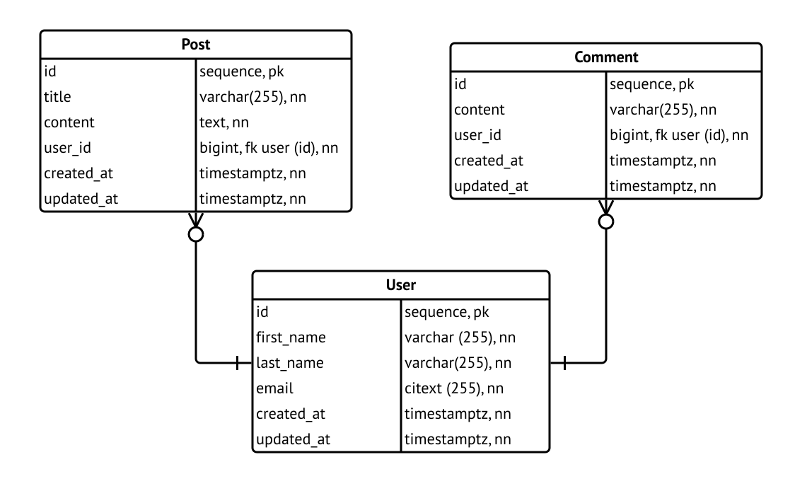
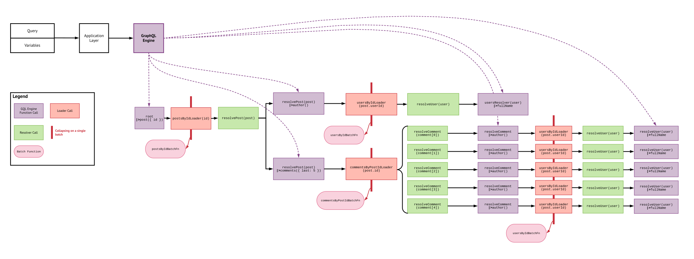

A few months ago I wrote an article about my architectural concerns relating to dealing
with many of the issues that arise on a GraphQL production system. My work
on this topic has continued over the next few months, and I have been able to build a working system
in a low-volume but highly critical production system.

From what I learned by building this system, I have created a mature mental
model about how a GraphQL data layer that pulls data from multiple databases and
services at the same time should work, and started the development of a
small Typescript microframework that leveraged the use of these concepts.

<hr>

The goal of this article is to present a motivating example of creating a
GraphQL framework that simplifies the workload of creating data layer backends
for services architectures.

Throughout this article, we will discuss the implementation of a data layer
for a straightforward blog system that has three entities: `Post`, `Comment` and `User`.

We'll follow a deductive approach where we introduce existing knowledge, expand on it,
and after finding issues, follow up by proposing solutions. At the end, we'll present 
the conclusions from this process and provide a brief summary of the characteristics 
needed in our framework.

## Prior Knowledge

Before starting, we'll touch on what's available right now for working with
GraphQL backends.

### GraphQL

In the rest of this document, we assume the reader is at least familiar with the GraphQL notation
and has some knowledge of how to go about writing a query. The [official documentation](https://graphql.org)
and [this cheatsheet](https://wehavefaces.net/graphql-shorthand-notation-cheatsheet-17cd715861b6)
are useful as a reference until you memorize the notation.

### GraphQL.js

[GraphQL.js](https://graphql.org/graphql-js/) is the official implementation of
GraphQL, and can be though of as the reference implementation, since most of the RFCs
to the protocol end up being implemented in this library first.

Under the hood, this library provides a function called `graphql` which accepts
a schema, an object with functions, the query, and its variables; and returns
the resolved JSON data object.

No assumptions are made about the application or transport layer, or even the platform!
This library is perfectly capable  of running in the browser with very little trouble at all.

However, be aware that this library provides a whole package of features for parsing
queries, dealing with errors, **building schema objects from GraphQL files**, among
others.

Since this (1) is the official implementation on GraphQL, (2) runs on a popular
language (modern JavaScript), (3) massively simplifies dealing with concurrency
and (4) includes type declarations, it's easy to conclude that providing a
GraphQL backend in Node over JavaScript or TypeScript is the best approach for
dealing with GraphQL backends.

To summarize, the core GraphQL.JS API is as follows
[[1](https://graphql.org/graphql-js/graphql/#graphql)]:

```typescript
graphql(
  schema: GraphQLSchema,
  requestString: string,
  rootValue?: ?any,
  contextValue?: ?any,
  variableValues?: ?{[key: string]: any},
  operationName?: ?string
): Promise<GraphQLResult>
```

Here:

- `schema` is the **parsed schema** (as a JS object). You can create this JS object
  from a GraphQL schema string by invoking `buildSchema(schemaString)` [[2](https://graphql.org/graphql-js/utilities/#buildschema)].
- `requestString` is the GraphQL **query string** we want to run against the schema.
- `rootValue` is the root value passed to the executor.
- `contextValue`, will be passed to all resolving functions (more later).
- `variableValues`, values for each of the variables present in the `queryString`.
- `operationName`, the name of the operation, if any.

### How GraphQL.JS Resolves a Request

Let's completely forget for a second about the web server and any implementation
detail and consider the following GraphQL **schema**:

```graphql
type Query {
  myValue: String
}

schema {
  query: Query
}
```

The obvious **query** is then:

```graphql
{
  myValue
}
```

For the backend to **resolve** this value, we need to pass an object
that implements the requested values. We can do it in many ways:

**By passing an object.** We can just simply say:

```typescript
const rootValue = {
  myValue: 'hello'
}
```

and pass it to the `graphql` definition above. This provides the benefit that
is statically typed. However, what happens if we want to provide a difficult
to compute or dynamic value based on the current session? You can solve this...

**By passing a function.** Instead, we can do:

```typescript
const rootValue = {
  myValue() {
    return 'hello';
  }
}
```

This way, the value is **thunked** and this function will be called every
time the value is requested on the query. This is not an implication but an equivalence:
if the value is not requested then the function **won't be called**.

Moreover, this function can accept arguments:

```typescript
myValue(args, context, ast)
```

where `args` is an object containing the arguments if `myValue` was implemented as GraphQL
function in the schema definition, `context` is the context defined by the API
above, and `ast` is an [Abstract Syntax Tree](https://en.wikipedia.org/wiki/Abstract_syntax_tree)
i.e. an in-memory JS representation of the current parsed `requestString`.

**By passing a promise.** For fully exploiting the possibilities of modern
asynchronous JavaScript, `myValue` can also be a promise:

```typescript
const rootValue = {
  async myValue() {
    return 'hello';
  }
}
```

`GraphQL.JS` will wait for the promise to be fulfilled. Moreover, if any root
values that are async functions are called at the same time on a query, **these
will be called in parallel and the engine will wait for all to them to resolve in
the same tick of the event loop.**

### The Concept of a Loader

[`DataLoader`](https://github.com/facebook/dataloader) is a JavaScript library
created by Facebook and meant to be used as a data fetching layer. It's used for
**batching** requests, i.e. given some resource IDs that need to be fetched
across a concurrent program flow, consolidate them together on a single list of
IDs, perform a single data request and pass back the results where requested into
the program flow.

The API is extremely simple:

```typescript
const Dataloader = require("dataloader")
```

To create a loader, we need to provide a batch function that receives
a list of **scalars** (objects **won't work**) and returns a Promise that resolves
to a list of results where each position matches the requested scalar id.

As an example, if we pass `[1, 7, 3]` to our batch function, then we need to
return `[/* Result 1 */, /* Result 7 */, /* Result 3 */]` **even if the results
are `null`-ish**.

Then, we can implement something close to:

```typescript
async function myBatchFunction(ids) {
  console.log("The IDs are:", ids)

  return ids
}

const myLoader = new Dataloader(myBatchFunction)
```

What does this in action? Let's see it but running some concurrent code:

```typescript
Promise.all([
  myLoader.load(4),
  myLoader.load(9),
  myLoader.load(2),
]).then(ids => console.log("Done! IDs:", ids))

// Output:
// > The IDs are: [ 4, 9, 2 ]
// > Done! IDs: [ 4, 9, 2 ]
```

The created loader halts the execution until the next tick of the event loop for
each promise, which in this example happens just after all functions have been
invoked and the code is no longer blocking. This gives time to consolidate all of the
requests that are required for the next tick of the event loop.

`Dataloader` then consolidates them into a single list, creates a `Map`, and calls
`myBatchFunction` just once with the requested IDs as can be seen on the request.
It then passes back the results to each of the calls.

DataLoader also implements a **short-lived** cache for the requested IDs, which
means that if you invoke `myLoader.load(4)` or `myLoader.load(2)` again in
your program flow with this loader instance, `myBatchFunction` won't be called again
since the result is already saved in memory.

Pay special attention:

- No assumptions are made about what you call inside `myBatchFunction`. You can
  make SQL queries, Mongo queries, HTTP calls or even call your favorite gRPC
  service.

- This library is compelling for running concurrent code since you can
  run many Promises at the same time and treat the loader as a single-result
  fetcher. If you sync your non-blocking calls and you efficiently implement
  `myBatchFunction`, you can almost completely forget about `n+1` queries.

### ES6 JavaScript

It's clear from the previous examples that a solid understanding of ESNext JS
features are required to write idiomatic and concise code that deals
with concurrency.

JS Concurrency is one of the key concepts in efficiently
working with GraphQL backends.

## The Motivating Example

Let's focus now on our motivating example for the blog system. Let's start with
this simple Entity-Relationship diagram. We're not assuming that this is implemented
in a SQL database, or even a single system. Each of the resources can be
easily represented as a small micro-service.



Given these entitities, let's discuss the implementation of a GraphQL backend that
enables us to use it to perform the most relevant queries for our frontend.

## The Naive Implementation

Throughout this section, we'll walk through step by step how to implement this
backend, and resolve the issues we encounter by finding workarounds.

Leaving the data storage implementation aside, we'll just focus on implementing a `schema`
and `rootValue` that can resolve a single `requestQuery` by invoking `graphql`.
Moving this then to an HTTP server or even a WebSockets implementation is completely
decoupled from what we are doing in this article and should be fairly
straightforward.

### The Schemas

Let's discuss the type definitions we need to implement for our GraphQL backend:

**`Post`:** This is going to extend a little longer to illustrate many of the
features for schema definition:

```graphql
"""
Any comment above a definition will autogenerate docs for it.
"""
type Post {
  """
  The identifier element in the node of the graph is labeled as ID. It will
  always be cast to a string.
  """
  id: ID!
  """
  The exclamation sign (!) indicates that a runtime error must be produced in
  the server and/or the client if this value comes as null.
  """
  title: String!
  """
  These fields are non-nullable in the ER, so something really wrong is happening
  if these are null.
  """
  content: String!
  """
  Idiomatic GraphQL is formatted in camelCase, not in snake_case.
  """
  userId: Int!
  """
  The lightweight way of sending a timestamp is to use the seconds after unix epoch as an integer.
  """
  createdAt: Int!
  """
  Same here.
  """
  updatedAt: Int!
  """
  Relations can be easily added just by declaring them. User might not be
  found if there's a data inconsistency, so in this case, it's better to declare
  it as nullable (no exclamation mark).
  """
  user: User
  """
  This will be a function receiving the last `n` comments from the post which returns
  an array of non-null elements. The array is nullable, but each element inside is
  not.
  """
  comments(last: Int! = 5): [Comment!]
}
```

**`Comment`:** Based on guidelines above:

```graphql
type Comment {
  id: ID!
  comment: String!
  userId: Int!
  createdAt: Int!
  updatedAt: Int!
  user: User
}
```

**`User`:** 

```graphql
type User {
  id: ID!
  firstName: String!
  lastName: String!
  email: String!
  createdAt: Int!
  updatedAt: Int!
  """
  You can also include extra computed properties. GraphQL schemas are not coupled
  to the data source.
  """
  fullName: String!
  posts(last: Int! = 5): [Post!]
  comments(last: Int! = 5): [Comment!]
}
```

**The Root:** Given these type definitions, we can provide the root values:

```graphql
type Query {
  post(id: ID!): Post
  posts(last: Int! = 5): [Post!]
  comment(id: ID!): Comment
  user(id: ID!): User
}

schema {
  query: Query
  """
  Uncomment to add mutation RPCs.
  """
  # mutation: Mutation
}
```

For one small project, we can just concatenate all these schemas into a single
string and call `buildSchema` with it as an argument. **However, in a bigger project,
we need a horizontal way to split this over multiple files.**

We'll need to provide a `rootValue` to `graphql` with something similar to this
prototype:

```typescript
const rootValue = {
  async post({ id }, ctx, ast) {
    throw new Error("Implement me!")
  },
  async posts({ last }, ctx, ast) {
    throw new Error("Implement me!")
  },
  async comment({ id  }, ctx, ast) {
    throw new Error("Implement me!")
  },
  async user({ id }, ctx, ast) {
    throw new Error("Implement me!")
  }
}
```

## Some Queries

By trying to expand some queries we can start fleshing out this GraphQL Backend.

### A Simple `Post` Query

Let's consider this query:

```graphql
query getPost($id: ID!) {
  post(id: $id) {
    id
    title
    content
  }
}
```

Considering it as a string inside the `requestString` variable, we can set `variableValues`
as:

```typescript
const variableValues = {
  id: 2
}
```

On a real program this would be part of the incoming request, usually as a request
body.

The GraphQL Engine is going to call `user({ id }, ctx, ast)` with `id = 2` given these
values, and then wait for the Promise to resolve. It's clear that we need to implement
this function, so let's consider an ORM/ODM model `Post`:

```typescript
async function post({ id }) {
  // Returns fields defined in the E-R diagram on top as camelCase.
  // However, you can put whatever you want here in order to resolve the contents!
  const post = await Post.findOne({ where: { id } })

  return post
}
```

The engine will retrieve the returned `post`, extract `id`, `title` and `content`
from it and send it back as a result. We can see here that `userId`, `createdAt` and `updatedAt`
were not required and thus were not sent: they can simply be considered an overfetch
for this request.

### Requesting Two Posts At The Same Time

Now let's consider this valid query:

```graphql
query getPosts($id1: ID!, $id2: ID!) {
  post1: post(id: $id1) {
    id
    title
    content
    userId
    createdAt
    updatedAt
  }
  post2: post(id: $id2) {
    id
    title
    content
    userId
    createdAt
    updatedAt
  }
}
```

We can pass `variableValues` as:

```typescript
const variableValues = {
  id1: 3,
  id2: 9
}
```

The GraphQL engine will call `async post({ id }, ctx, ast)` 2 times, **in
parallel**, passing `id = 3` to the first one and `id = 9` to the second one.

If we kept our implementation of `post()` above, we'd be performing two
function database calls to fulfill this request. If the client needed 5
posts, then 5 calls would be made. It's clear that our naive `async post()`
implementation above won't work efficiently in these cases.

However, since these functions calls are parallelized, **we can easily batch
them!**. Here's a more comprehensive implementation of `post`:


```typescript
const Dataloader = require('dataloader')

async function loadPostsById(ids) {
  const posts = await Post.findAll({
    where: {
      id: {
        $in: ids
      }
    }
  })

  // For each request ID we find the post in the results, which keeps
  // the order of the results as required by DataLoader. Even non-existent
  // results are properly located, but be aware that `Post` results might come in any order,
  // and that not all requested ids necessarily exist in the database.
  //
  // This is O(n^2) and thus sub-optimal. We can increase spatial complexity to
  // O(n) o resolve this in O(n) time. However, for the purpose of this example
  // it's illustrative enough.
  return ids.map(id => // O(n)
    posts.find(post => post.id === id) // O(n)
  )
}

// DataLoader creates **short-lived** caches. This is NOT meant to live in the
// program global scope on a production environment.
const postsByIdLoader = new Dataloader(loadPostsById)

// This implementation goes into rootValues, implementing the interface as expected.
async function post({ id }) {
  const post = await postsByIdLoader.load(id)

  return post
}
```

With this approach, we're now successfully batching all our root requests into a
single query. Hooray!

### Requesting a Computed Property

Now let's consider this query:

```graphql
query getAuthor($id: ID!) {
  user(id: $id) {
    id
    fullName
    email
  }
}
```

See here that `fullName` is not part of the E-R diagram and is declared as a field
on the GraphQL schema.

A basic implementation using a loader might be as follows:

```typescript
async function loadUsersByIds(ids) {
  const users = await Users.findAll({
    id: {
      $in: ids
    }
  })

  // Don't do this in production.
  return ids.map(id =>
    users.find(user => user.id === id)
  )
}

// Don't put this in the global scope in production, per above.
const usersByIdLoader = new Dataloader(loadUsersByIds)

async function user({ id }) {
  // Users columns camelCased as an object
  const user = await usersByIdLoader.load(id)

  return {
    ...user, // All previously specified columns
    fullName: `${user.firstName} ${user.lastName}`
  }
}
```

The problem is that, if we don't need `fullName`, we'd still be computing it
with this approach. It would be especially problematic for expensive computations
or when there are multiple computed properties.

Once again, **GraphQL.JS allows you to wrap the responses in functions and/or
promises**. For this example, when `user` returns, the engine will know that it
needs `fullName`. If we wrap `fullName` in a function, the engine will call that function to retrieve the value.
You can even put `fullName` wrapped in an async function and the engine will
call all the promises in parallel and wait for them to resolve.

Since we just need to interpolate strings, there's no need for an async function
in this case, so we will just wrap it with a normal function:

```typescript
async function user({ id }) {
  // Users columns camelCased as an object
  const user = await usersByIdLoader.load(id)

  return {
    ...user, // All previously know columns
    fullName() {
      return `${user.firstName} ${user.lastName}`
    }
  }
}
```

### Loading Data Relationships

One of the most interesting examples here is when we need to load an entity
plus some of its relationships. Consider this query:

```graphql
query getFullPost($id: ID!) {
  post(id: $id) {
    id
    title
    content
    createdAt
    author {
      id
      fullName
      email
    }
    comments(last: 5) {
      id
      content
      createdAt
    }
  }
}
```

Given that we have already implemented `posts` above, we just need to extend it in
order to make `author` and `comments` functions available. Without this step, they'd
just return null since they're undefined in the resolved object:

```typescript
async function post({ id }) {
  const post = await postsByIdLoader.load(id)

  return {
    ...post,
    async author() {
      throw new Error("Implement me!")
    },
    async comments() {      
      throw new Error("Implement me!")
    }
  }
}
```

Once again, the naive approach would be by calling the ORM and resolving the
objects individually. If we pulled 5 posts instead of 1 in our root query, we'd
perform 5 `author` queries and 5 `comments` queries. You probably know this as an `n+1` query
 - one of the most significant pain points when using GraphQL.

However, what happens if we put some loaders inside these definitions 😛? The
GraphQL Engine would resolve as follows:

1.  Call `posts`. The function resolves to the object in the return statement.
    
2.  The engine needs `author` and `comments`. Both are async and are called *in
    parallel*.
    
3.  `author` calls a loader inside for each call and the loader halts the loading
    until the next tick of the event loop. Likewise for `comments`.
    
4.  The loader for `author` consolidates all IDs in a single list and passes them
    to the batch function. **Users will be loaded in a single query**, and the same for
    comments.

5.  The loader passes back the results to each `author` call. The `author` then
    resolves the required result.

Let's implement it!

```typescript
async function post({ id }) {
  const post = await postsByIdLoader.load(id)

  return {
    ...post,
    async author() {
      const author = await usersByIdLoader.load(post.userId)

      return {
        ...author,
        // Don't forget the query is asking for fullName here.
        fullName() {
          return `${author.firstName} ${author.lastName}`
        }
      }
    },
    async comments() {
      // You already get the idea. Let's not spend time retrieving this
      // right now.
      const comments = await lastFiveCommentsByPostIdLoader.load(post.id)

      return comments
    }
  }
}
```

With this approach, you can convert any query with 3 levels of nesting into 3 queries
instead of `(n+1)^3` queries.

Many important things to note here:

1.  Once again, note that what you put inside the loader batch function is up
    to you. You can put any database calls, HTTP API calls, gRPC calls, or
    just compute something else to your taste.

2.  What you put in the `posts` loader can be utterly different from the
    `users` loader. You can make an HTTP API call for `posts` and a gRPC call for
    `users` to a completely different service. This means that the **loader**
    essentially becomes the glue between many different documents.

3.  Be careful not to abuse batchers. You can easily shoot yourself in the foot by trying
    to load 100 resources at a time. Everything you do should consider pagination.
    Moreover, this is not a panacea, nor a replacement for SQL for complex queries.
    This is only meant to pull the data you need to populate your frontend.

4.  There's no benefit to using a loader if you're still pulling each of the IDs individually.
    If you're loading from a SQL database, try `IN` operators over
    columns with indices (or other more performant approaches). For a HTTP call
    you must provide an endpoint to load multiple items at once. On an Elastic
    cluster you might need to use `mget` to retrieve your results.

### Don't Repeat Yourself

Let's make the previous query a little bit more complicated by adding an extra
`author` node to the `comments` node:

```graphql
query getFullPost($id: ID!) {
  post(id: $id) {
    id
    title
    content
    createdAt
    author {
      id
      fullName
      email
    }
    comments(last: 5) {
      id
      content
      createdAt
      author {
        id
        fullName
        email
      }
    }
  }
}
```

We'll need to update our root value to do this by changing the `comments` function:

```typescript
async function post({ id }) {
  const post = await postsByIdLoader.load(id)

  return {
    ...post,
    async author() {
      const author = await usersByIdLoader.load(post.userId)

      return {
        ...author,
        // Don't forget the query is asking for fullName here.
        fullName() {
          return `${author.firstName} ${author.lastName}`
        }
      }
    },
    async comments() {
      // You already get the idea. Let's not spend time retrieving this
      // right now.
      const comments = await lastFiveCommentsByPostIdLoader.load(post.id)

      return comments.map(comment => ({
        ...comment,
        user() {
          const user = await usersByIdLoader.load(comment.userId)

          return {
            ...user,
            // We need to do this, again!
            fullName() {
              return `${user.firstName} ${user.lastName}`
            }
          }
        }
      }))
    }
  }
}
```

You can see that since we need to resolve the name again, we duplicated the
code. It's clear now that we can wrap that in a synchronous function:

```typescript
function resolveUser(user) {
  return {
    ...user,
    fullName() {
      return `${user.firstName} ${user.lastName}`
    }
  }
}
```

Then we can refactor our code to:

```typescript
async function post({ id }) {
  const post = await postsByIdLoader.load(id)

  return {
    ...post,
    async author() {
      const author = await usersByIdLoader.load(post.userId)

      return resolveUser(author)
    },
    async comments() {
      // You already get the idea. Let's not spend time retrieving this
      // right now.
      const comments = await lastFiveCommentsByPostIdLoader.load(post.id)

      return comments.map(comment => ({
        ...comment,
        async user() {
          const user = await usersByIdLoader.load(comment.userId)

          return resolveUser(user)
        }
      }))
    }
  }
}
```

But, this will happen again with comments, with authors and with
everything that we would want to re-use! We can continue with posts and
comments as follows:

```typescript
function resolveComment(comment) {
  return {
    ...comment,
    async user() {
      const user = await usersByIdLoader.load(comment.userId)

      return resolveUser(user)
    }
  }
}

function resolvePost(post) {
  return {
    ...post,
    async author() {
      const author = await usersByIdLoader.load(post.userId)

      return resolveUser(author)
    },
    async comments() {
      // You already get the idea. Let's not spend time retrieving this
      // right now.
      const comments = await lastFiveCommentsByPostIdLoader.load(post.id)

      return comments.map(comment => resolveComment(comment))
    }
  }
}
```

Then our root value becomes:

```typescript
async function post({ id }) {
  const post = await postsByIdLoader.load(id)

  return resolvePost(post)
}
```

All the logic for getting the comments and the author is encapsulated into this
**resolver** function and is now reusable. If we have any other nodes that have a `Post`
type as a child, we can just call this resolver and handling of `author` and
`comments` will be immediately available.

Formally, a **resolver** function is a **synchronous** and **pure** (no side
effects) that retrieves some attributes and return the object that the GraphQL
Engine needs to resolve the requested information on the node.

This is the essential component or re-usable unit and ensures that we don't have to
deal with any possible combination that might be asked of the GraphQL Tree.

As a side-note, you might notice that `author()` in `resolvePost` and `user()` in `resolveComment`
have very similar behavior. You might create another high order function, invoking
it and passing it down to those keys.

## Summary

Throughout our discussion, we've observed that some of the issues that arise when
creating a GraphQL backend are:

- Creating Schemas and Root Values. We need to find a way to split schemas and
  `rootValues` into multiple files.

- Joining nodes from multiple data sources, avoiding `n+1` queries.

- Keep things DRY. Given the results from the data source, get a re-usable unit
  that converts those results to an object that `GraphQL.js` can resolve. This
  object has thunked methods for accessing other nodes in the graph.

We've just given conceptual solutions to all of these problems by providing:

1.  **Root Values**: Functions that accept parameters and are at the root of our
    Graph schema.

2.  **Loaders**: Objects built from functions with specific conditions that,
    when called, batch all the requests for execution, call a data source just
    once, and pass results back to the running functions of the GraphQL
    engine.

3.  **Resolvers**: Pure and synchronous functions that map the results from the
    loader and convert them to a reusable object that can be used by the GraphQL
    engine to query the node.

These concepts are **the fundamentals** of our architecture to deal with GraphQL
backends, and (for lack of a better name) can be called the **Root - Loader -
Resolver** Architecture (RLR), since that is the way the data flows.

You can also make some connections to a traditional MVC architecture:

- The Root Value is behaving as a **Controller** in the sense that receives some
  parameters, uses them to invoke a data source, and passes the data source to
  a view.

- The Loader can be compared to a **Model** in the sense that it pulls data from a
  data source with a pre-defined structure and a set of business rules.

- The Resolver can be compared to a **View** in the sense that receives information
  from a root value or another function and converts it to an object that can be
  used by the consumer (the `GraphQL.js` Engine).

Also note that just like in an MVC architecture, these are just conceptual
boundaries. Even though it is not encouraged (and can even be an antipattern), you're
still able to do both the Loader and the Resolver jobs in a single root value.
Nothing is forcing an engineer to work this way, it's more of a conceptual
background.

This architecture is good enough to solve most of the data layer problems on a
traditional services environment with multiple data sources. Despite being meant for use in 
a multi-services system, it could still be used
in a traditional monolithic approach with just a single database; however,
the overhead would significant compared to tools like Join Monster, Apollo
Server or Prisma GraphQL.

Finally, note that this pattern could be easily implemented with any Turing complete
language, but concurrent languages like JavaScript, Elixir or Golang
make it simpler to build idiomatic and performant code. You might encounter more
difficulty when using languages not including native syntax/interpreter support for concurrency programming, like Python or Ruby.

### Summarizing Diagram

For the final and most complicated query in this article above, the 
execution that the GraphQL Engine performs can be summarized in the following
diagram (try to zooming in), from left to right:

[](graphql-motivation-flow.svg)

### What Do We Need For This Framework?

This discussion is the conceptual underpinning for creating a backend
framework that:

- Is **entirely** decoupled from the application and transport layer involved
  in the invocation of `graphql`. It should **smoothly** work on ExpressJS, Koa
  or even through WebSockets.

- Easily composes to build schemas and root values from multiple files and small
  functions.

- Provides loader instances (1) on demand and (2) for each `graphql` call/request
  given the batching function.

- Enables us to idiomatically use resolvers, automatically detecting arrays and applying
  the resolver to every function.

- Leverages the use of static typing (i.e. TypeScript) to efficiently manage
  a large scale project, keeping the use of singletons and mutable state as low
  as possible.

### Remaining Considerations

Many things are not covered in this article that are worthy of entire articles themselves:

- Even though this architecture is scalable and performant, you're still not
  intended to completely expose your GraphQL service in a production environment.
  Allowing any arbitrary query is risky since a malicious actor can easily
  break the entire infrastructure given intensive enough queries.

- No discussion of mutations yet - they are an entire subject to themselves.
  The bottom line is that you can proxy these calls to the services or think about
  the mutations as orchestrated calls to multiple services at once. They are still
  just functions that you define in your `rootValues` object. However, it is clear
  that the main purpose of GraphQL is to pull data, so that's the reason why we've kept most
  of the emphasis there.

- Pagination in GraphQL is made by being compliant to the
  [Relay Cursors Connections Specification](https://facebook.github.io/relay/graphql/connections.htm).
  This is a complicated enough topic that it requires further explanation separately.
 
- How do deal with logging and tracing in this infrastructure?

- How to provide and format custom errors.

<hr>

Thank you for the time spent reading this article. The framework implementing the concepts covered in this
motivational discussion has already been created and even battle tested in a
real production environment. I am looking forward to open-sourcing it.

This article for sure will become part of the architectural documentation of
that framework.
